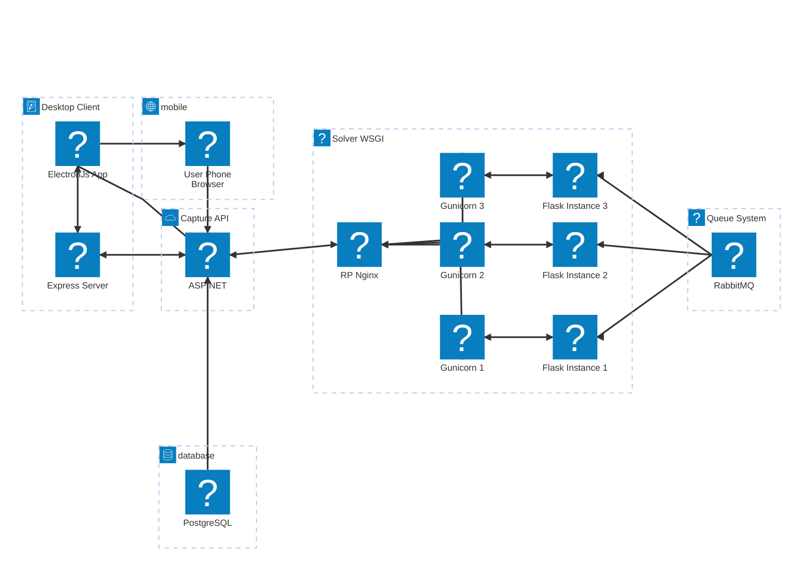

```mermaid
architecture-beta
    group desktop_app(disk)[Desktop Client]
    group solver(logos:python)[Solver WSGI]
    group queueing_system(logos:rabbitmq)[Queue System]
    group captureAPI(cloud)[Capture API]
    group db(database)[database]
    group mobile(internet)[mobile]

    service mobile_client(logos:react)[User Phone Browser] in mobile

    service express_server(logos:express)[Express Server] in desktop_app
    service electron_client(logos:electron)[ElectronJs App] in desktop_app


    service api_capture(logos:dotnet)[ASP NET] in captureAPI
    service postgres_db(logos:postgresql)[PostgreSQL] in db
    

    service nginx_rp(logos:nginx)[RP Nginx] in solver

    service gunicorn_1(logos:gunicorn)[Gunicorn 1] in solver
    service gunicorn_2(logos:gunicorn)[Gunicorn 2] in solver
    service gunicorn_3(logos:gunicorn)[Gunicorn 3] in solver

    service flask_instance_1(logos:flask)[Flask Instance 1] in solver
    service flask_instance_2(logos:flask)[Flask Instance 2] in solver
    service flask_instance_3(logos:flask)[Flask Instance 3] in solver
    
    service rabbitmq_service(logos:rabbitmq)[RabbitMQ] in queueing_system


    junction junctionCenter
    junction junctionCenterDesktop


    junctionCenterDesktop:L --> R:express_server
    junctionCenterDesktop:T --> B:electron_client
    junctionCenterDesktop:B --> L:api_capture

    api_capture:R <--> L:nginx_rp
    api_capture:B <-- T:postgres_db

    electron_client:R --> L:mobile_client
    electron_client:B --> T:express_server
    mobile_client:B --> T:api_capture

    nginx_rp:R <-- T:gunicorn_3
    nginx_rp:R <-- B:gunicorn_1
    nginx_rp:R <-- L:gunicorn_2

    gunicorn_1:R <--> L:flask_instance_1
    gunicorn_2:R <--> L:flask_instance_2
    gunicorn_3:R <--> L:flask_instance_3


    rabbitmq_service:L --> R:flask_instance_1
    rabbitmq_service:L --> R:flask_instance_2
    rabbitmq_service:L --> R:flask_instance_3
```